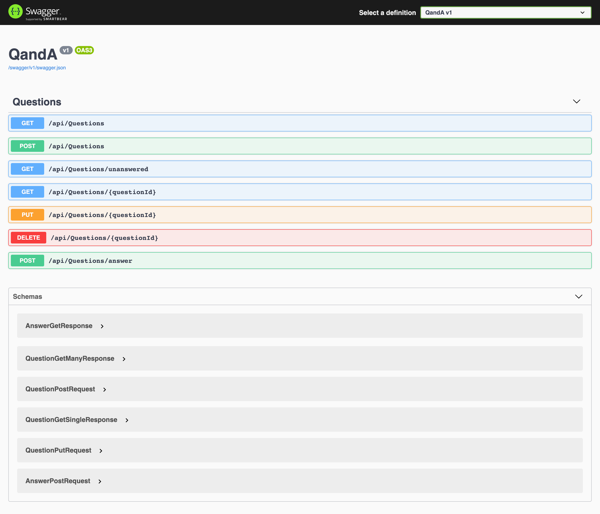

# .NET Core QA API
Simple crud example of how a Quiz API could be structured. Includes caching and paging for better performance.
Uses [Dapper](https://github.com/DapperLib/Dapper) for interaction with database.



# Prerequisites
- .NET 5.0
- A local instance of a SQL Server Database

# Get started

* Add the connection string to `appsettings.json` and run the project
```
{
  "ConnectionStrings": {
---->"DefaultConnection": "YOUR-SQL-SERVER-DATABASE-STRING"
  },
}
```

* Run your project and go to `https://localhost:5001/swagger/index.html` in your browser